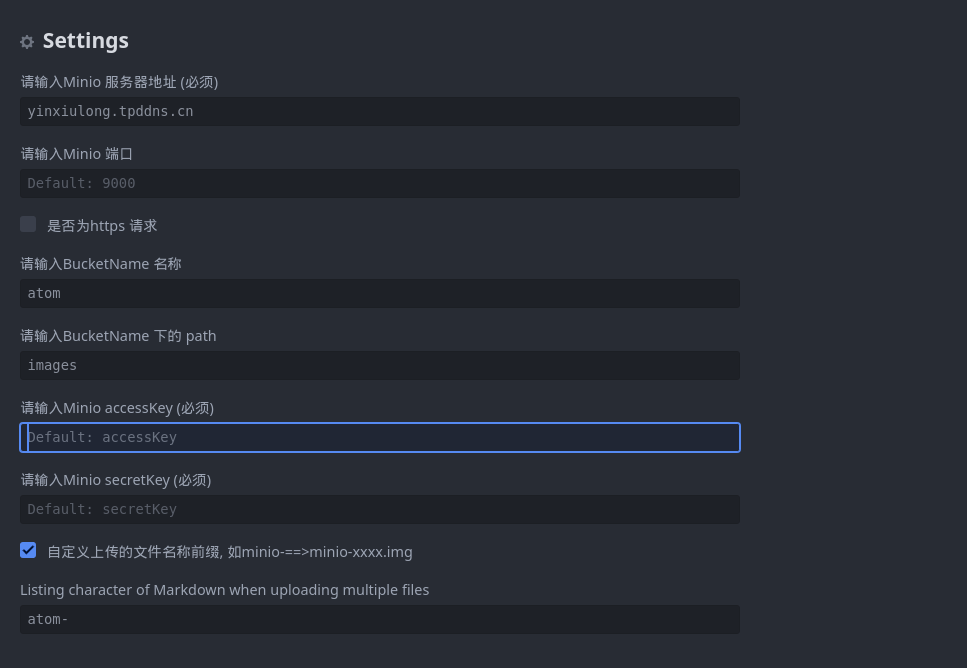

# s3uploader-minio

#前言：
此插件是通过tearoom6  https://github.com/tearoom6/s3uploader 修改得来，特别感谢tearoom6

通过拖拽 和 Ctrl+V 复制粘贴功能可以将图片上传到自定义的Minio 对象存储上。

It's designed to be convenient to use with [sync-sync](https://atom.io/packages/sync-sync).

## Features

- [x] 通过拖放上传文件。
- [x] 通过复制和粘贴上传文件。
- [x] 将文件上载到Minio。
- [x] 输出为标记标签（图像或链接）。
- [x] 输出为HTML标记（图像或链接）。

### s3uploader-minio 设置

After installing this package:

1. Open Atom app.
2. Click [Command] + [,] to open preferences.
3. Select [Packages] and find s3uploader-minio, then click [Settings].
4. Set values properly like below.

